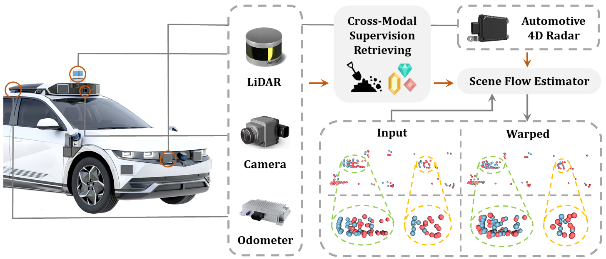
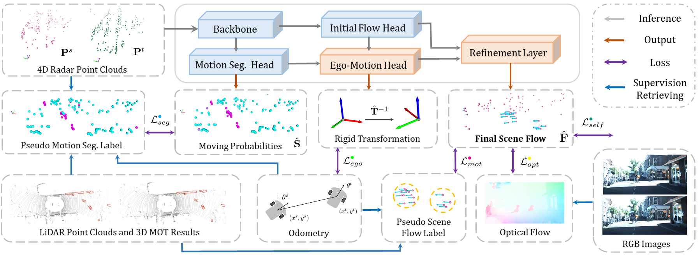
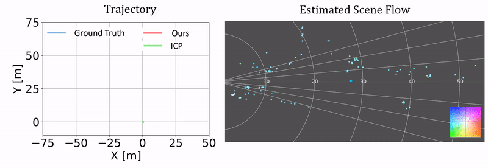
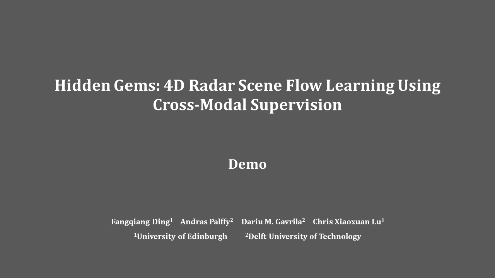

<div align="center">   

# Hidden Gems: 4D Radar Scene Flow Learning Using Cross-Modal Supervision
</div>

[](https://arxiv.org/abs/2303.00462)
[](https://www.youtube.com/watch?v=PjKgznDizhI&feature=youtu.be) 

[](https://github.com/Toytiny/CMFlow/blob/master/LICENSE)  [](https://toytiny.github.io/publication/23-cmflow-cvpr/index.html)

<p align="center">


</p>


This is the official repository of the **CMFlow**, a cross-modal supervised approach for estimating 4D radar scene flow. 
For technical details, please refer to our paper on CVPR 2023:

**Hidden Gems: 4D Radar Scene Flow Learning Using Cross-Modal Supervision**
<br/>
[Fangqiang Ding](https://toytiny.github.io/), [Andras Palffy](https://scholar.google.co.uk/citations?user=_IIml4sAAAAJ&hl=en), [Dariu M. Gavrila](http://www.gavrila.net/), [Chris Xiaoxuan Lu](https://christopherlu.github.io/)
<br/>
[[arXiv]](https://arxiv.org/pdf/2303.00462.pdf) [[demo]](https://youtu.be/PjKgznDizhI) [[page]](https://toytiny.github.io/publication/23-cmflow-cvpr/index.html) [[supp]](https://drive.google.com/file/d/1Iewcqnjzecge2ePBM8k2tg-85LX5xs3N/view?usp=sharing)

<p align="left">

</p>

## News
 - [2023-02-28] Our paper is accepted by [CVPR 2023](https://cvpr2023.thecvf.com/) 🎉.
 - [2023-03-03] Our paper can be found on 👉 [arXiv](https://arxiv.org/pdf/2303.00462.pdf). Supplementary can be found [here](https://drive.google.com/file/d/1Iewcqnjzecge2ePBM8k2tg-85LX5xs3N/view?usp=sharing). Project page is built [here](https://toytiny.github.io/publication/23-cmflow-cvpr/index.html). 
 - [2023-03-15] Our code has been released. Please see 👉 [GETTING_STARTED](./src/GETTING_STARTED.md) for the guidelines.
 - [2023-03-21] Our paper is selected as a highlight 🎉 in [CVPR 2023](https://cvpr2023.thecvf.com/) (10% of the accepted papers).

## Citation
If you find our work useful in your research, please consider citing:


```shell
@inproceedings{ding2023hidden,
  title={Hidden Gems: 4D Radar Scene Flow Learning Using Cross-Modal Supervision},
  author={Ding, Fangqiang and Palffy, Andras and Gavrila, Dariu M. and Lu, Chris Xiaoxuan},
  booktitle={Proceedings of the IEEE/CVF Conference on Computer Vision and Pattern Recognition (CVPR)},
  pages={1-10},
  year={2023} 
}
```

## Getting Started

To find out how to run our scene flow experiments, please see our intructions in [GETTING_STARTED](./src/GETTING_STARTED.md). If you meet some issues when runinng our code, please raise them under this repository.


## Abstract 
This work proposes a novel approach to 4D radar-based scene flow estimation via cross-modal learning. Our approach is motivated by the co-located sensing redundancy in modern autonomous vehicles. Such redundancy implicitly provides various forms of supervision cues to the radar scene flow estimation. Specifically, we introduce a multi-task model architecture for the identified cross-modal learning problem and propose loss functions to opportunistically engage scene flow estimation using multiple cross-modal constraints for effective model training. Extensive experiments show the state-of-the-art performance of our method and demonstrate the effectiveness of cross-modal supervised learning to infer more accurate 4D radar scene flow. We also show its usefulness to two subtasks - motion segmentation and ego-motion estimation. 

## Method
|  | 
|:--:| 
| ***Figure 1. Cross-modal supervised learning pipeline for 4D radar scene flow estimation**. Given two consecutive radar point clouds as the input, the model architecture, which is composed of two stages (blue/orange block colours for stage 1/2), outputs the final scene flow together with the motion segmentation and a rigid ego-motion transformation. Cross-modal supervision signals retrieved from co-located modalities are utilized to constrain outputs with various loss functions. This essentially leads to a multi-task learning problem.* |

## Qualitative results
Here are some GIFs to show our qualitative results on scene flow estimation and two subtasks, motion segmentation and ego-motion estimation. For more qualitative results, please refer to our [demo video](#demo-video) or [supplementary](https://drive.google.com/file/d/1Iewcqnjzecge2ePBM8k2tg-85LX5xs3N/view?usp=sharing).

#### Scene flow

<p align="center">


</p>


#### Subtask - Motion Segmentation
<p align="center">


</p>

#### Subtask - Ego-motion Estimation
<p align="center">


</p>


## Demo Video 
<p align="center"> <a href="https://youtu.be/PjKgznDizhI"></a> </p>

